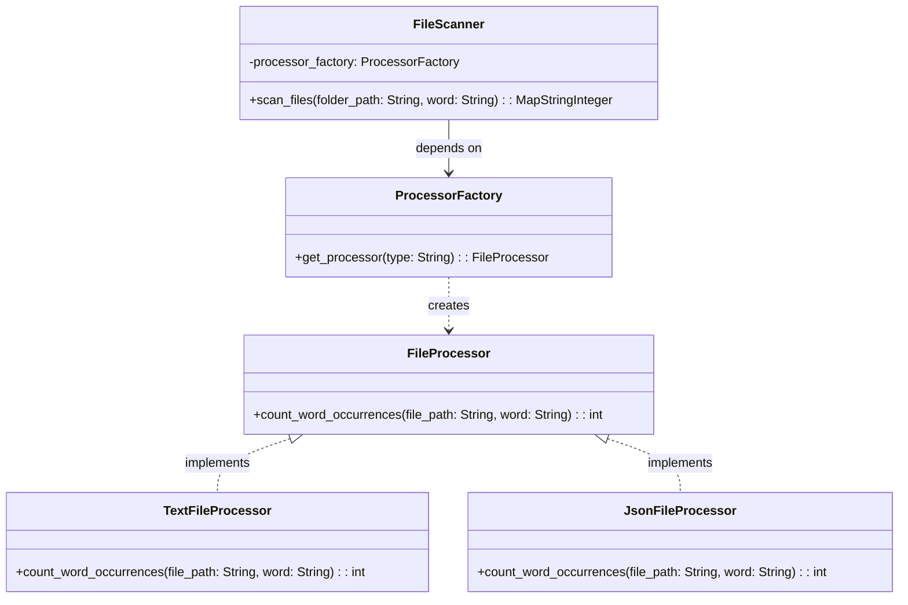

# IS-I-python

# Explicación del Modelo UML y Principios de Diseño de Software

El modelo UML proporcionado describe una estructura de clases diseñada para contar las ocurrencias de palabras en diferentes tipos de archivos. El diseño refleja varios principios clave de ingeniería de software:

## Principios de Diseño Aplicados

### Inversión de Dependencias (Dependency Inversion Principle)
- Las clases `TextFileProcessor` y `JsonFileProcessor` implementan la interfaz `FileProcessor`. Esto permite que `FileScanner` dependa de abstracciones (`FileProcessor`) en lugar de detalles concretos de implementación, lo que facilita la extensión y el mantenimiento del sistema.

### Separación de Intereses (Separation of Concerns)
- Cada clase en el modelo tiene una responsabilidad única: 
  - `FileProcessor` define la operación de contar ocurrencias de palabras.
  - `TextFileProcessor` y `JsonFileProcessor` manejan la lógica específica de cada tipo de archivo.
  - `ProcessorFactory` encapsula la creación de procesadores de archivos.
  - `FileScanner` gestiona el escaneo de archivos y delega el procesamiento de palabras a los procesadores apropiados.

### Principio de Abierto/Cerrado (Open/Closed Principle)
- Las clases están abiertas para la extensión pero cerradas para la modificación. Se pueden agregar nuevos procesadores de archivos implementando `FileProcessor` sin modificar `FileScanner` o `ProcessorFactory`.

### Inyección de Dependencias (Dependency Injection)
- `FileScanner` recibe una `ProcessorFactory` a través de su constructor, lo que le permite usar diferentes procesadores en tiempo de ejecución. Esto demuestra la inyección de dependencias y promueve un bajo acoplamiento.

## Explicación General del Modelo UML

- **FileProcessor (Interfaz)**: Define el contrato con un método `count_word_occurrences` para contar las ocurrencias de una palabra en un archivo.

- **TextFileProcessor y JsonFileProcessor (Clases)**: Implementaciones concretas de `FileProcessor` que especifican cómo contar las palabras en archivos `.txt` y `.json`, respectivamente.

- **FileScanner (Clase)**: Orquesta el proceso de escaneo de archivos utilizando un `ProcessorFactory` para asignar el procesador adecuado según el tipo de archivo.

- **ProcessorFactory (Clase)**: Fábrica que proporciona una instancia de un `FileProcessor` basada en el tipo de archivo, facilitando la extensión del sistema para soportar más tipos de archivos en el futuro.

Este diseño permite que el sistema sea fácilmente ampliable y mantenible, y muestra una clara separación de responsabilidades entre los componentes, lo cual es fundamental para un diseño de software sólido.
